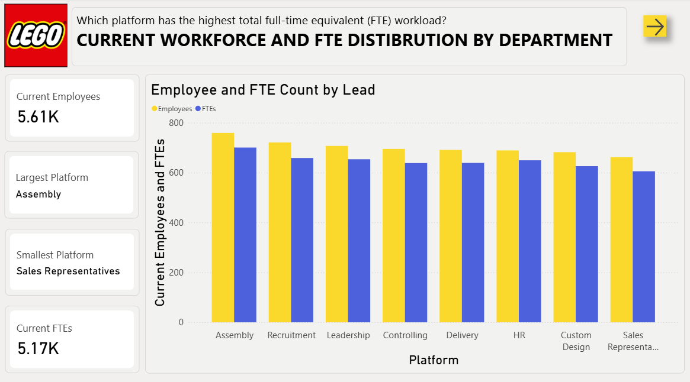

# 📊 LEGO Workforce Analytics – Power BI Project

This project is a fictional business intelligence solution built in Power BI, simulating workforce and HR-related analytics for LEGO. The goal is to demonstrate how data visualization and analysis can support decision-making in areas such as employee allocation, recruitment, retention, and engagement.

All data used in this project is entirely fictional and created for demonstration purposes only.

---

  
  
  
  
  
  
  
  
  

## 🧰 Tools & Technologies Used

- **Power BI Desktop** – for building interactive dashboards
- **Power Query (M language)** – for data transformation and preparation
- **DAX (Data Analysis Expressions)** – for calculated measures, KPIs, and dynamic visuals
- **Excel/CSV files** – as mock data sources

---

## 📌 Dashboard Overview

### 👥 Current Workforce & FTE Distribution
- Displays total number of employees and full-time equivalents (FTEs) across departments
- Highlights the largest and smallest platforms by FTE workload
- Bar chart comparing employee vs. FTE count per platform

### 🔄 Employee Transfers Across Departments
- Tracks monthly employee turnover across platforms for the year 2024
- Identifies departments with the highest number of leavers
- Interactive filters for platform selection

### 📉 Employees & Leavers by Lead
- Shows which team leads have the most employees and the most leavers
- Includes platform utilization percentages to identify overworked teams

### ⚙️ Working Capacity by Period
- Displays chargeability (workload percentage) for a specific domain over time
- Highlights over- and under-utilization using color-coded values
- Average chargeability: 99.6%

### 🧑‍💼 Recruitment Efficiency & New Joiners
- Shows number of new employees who joined in the past year across platforms
- Total new joiners: 44
- Includes celebratory visuals to enhance engagement

### 🗂️ Employee Allocation to Projects
- Table showing historical and current employee allocation to LEGO projects
- Includes chargeability status and percentage per project
- Highlights projects with highest and lowest current staffing levels

### 🧠 Skill Development & Hiring Planning
- Treemap and bar chart showing employee distribution by seniority level (Junior, Medior, Senior, Legend)
- Breakdown by platform to support strategic hiring decisions

### 🏢 Office Attendance Tracking
- Line chart tracking daily office attendance vs. target (300 attendees)
- Highlights low-attendance days and trends over time

### 🎉 Event Participation Analysis
- Bar chart showing total attendees per internal event (e.g. Pizza Day, Family Day, Halloween Party)
- Year selector to compare event success across 2023 and 2024

### 📋 Project Allocation by Lead
- Table and visual representation of chargeability per team lead and domain
- Uses LEGO face icons to indicate workload levels

---

## 📎 Notes

- All data is fictional and manually generated for educational and portfolio purposes.
- The dashboards are designed to showcase Power BI capabilities in HR analytics, workforce planning, and operational reporting.

---

## 📬 Contact

Feel free to reach out if you have questions or feedback about the project!

